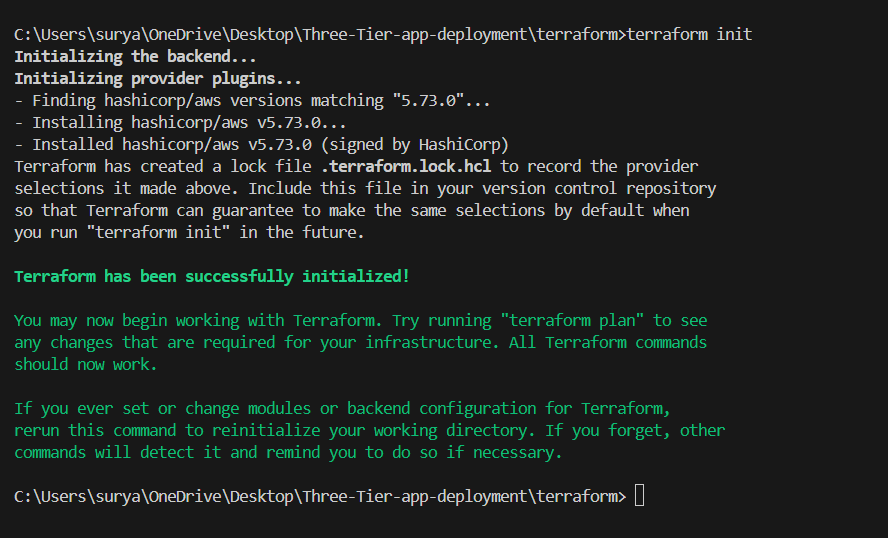

# CI/CD pipeline of three tier app


## prerequisites
  - AWS
  - terraform (basic, if not then you can manually create ec2 instance)
  - docker
  - kubernetes
  - EKS(Elastic kubernetes service)
  - basic jenkins
## jenkins master machine creation using terraform
- Open terraform folder and apply these commands
```
terraform init
```

```
terraform plan
```

```
terraform apply
```

- Enter "yes"


## Jenkins master machine
SSH to your jenkins master machine
```
ssh -i "yourKey.pem" ubuntu@ec2machinehost
``` 
### update machine packages
```
sudo apt-get update
```
### Jenkins installation
```
sudo wget -O /usr/share/keyrings/jenkins-keyring.asc \
  https://pkg.jenkins.io/debian-stable/jenkins.io-2023.key
```
```
echo "deb [signed-by=/usr/share/keyrings/jenkins-keyring.asc]" \
  https://pkg.jenkins.io/debian-stable binary/ | sudo tee \
  /etc/apt/sources.list.d/jenkins.list > /dev/null
```
```
sudo apt-get update
sudo apt-get install jenkins
```
### docker installation and allow for ubuntu user
```
sudo apt-get install docker.io
```
```
sudo chmod 777 /var/run/docker.sock
```
### awscli installation
```
curl "https://awscli.amazonaws.com/awscli-exe-linux-x86_64.zip" -o "awscliv2.zip"
unzip awscliv2.zip
sudo ./aws/install
```
### eksctl installation
```
curl -sLO "https://github.com/eksctl-io/eksctl/releases/latest/download/eksctl_$PLATFORM.tar.gz"

curl -sL "https://github.com/eksctl-io/eksctl/releases/latest/download/eksctl_checksums.txt" | grep $PLATFORM | sha256sum --check

tar -xzf eksctl_$PLATFORM.tar.gz -C /tmp && rm eksctl_$PLATFORM.tar.gz

sudo mv /tmp/eksctl /usr/local/bin
```

### Open ports of jenkins master machine using terraform or manually
- 30000-32767 kubernetes ports
- 6379 redis port
- 465 smtps port
- 3000-10000 application ports
- 25 smtp port
- 6443 k8s port

